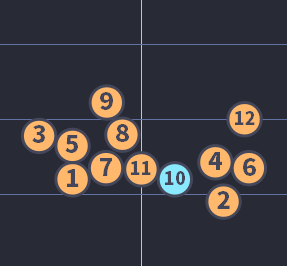
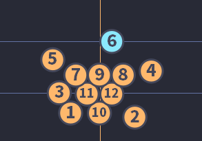
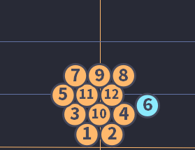

# モルック関連メモ

## オレオレ用語集

### エース

宣言どおりに命中すること。シングルで使うことが多いが、狙い通りならマルチでもエースとみなす。スコアでは○で囲むことで表現される。

技や特別なショットと組み合わせることもある。「ブレークエース」「フワリエース」

### シングル

1本のみ倒すこと。「8シングル」

### マルチ

複数本倒すこと。「2マルチ」

### ブレーク

束になっているスキットルに向かって投げること。ゲームの1投目を指すことが多いが、「ファーストブレイク」と呼び、ゲーム途中の場合は「ガシャ」と言うことも。

### 水平投げ

モルックを横に持って投げるスタンダードな投法。ホライゾナル。

### 縦投げ

モルックを縦に持って投げる変則的な投法。バーティカル。スキットルが横に並んだ状態でシングルを取りたい場合に使うことが多い。

### 裏投げ

水平投げだが、モルックを逆手に持って投げることで軽くバックスピンをかける。転がらない（ランが出ない）ので、スキットルが縦に並んだ状態で手前のみを倒したい場合に使う。

3〜4mのショートレンジで使うことが多かったが、近年ではミドルレンジでもランを出さないために多用するプレーヤーも登場している。

また、裏投げが弱く当たることを利用し、縦に隣接しているスキットルの手前に弱く当て、後ろのスキットルのみを倒す「コツ」も普及しはじめている。

### フワリ

モルックを山なりに投げることで、縦に並んだうち手前のスキットルを越えて後ろのスキットルのみを倒すこと。ロブ。

最近では縦投げと組み合わせてピンポイントに狙うプレーヤーも登場している。

### ショート

目標までの距離が短いシチュエーション。だいたい3.5〜5m

### ミドル

目標までの距離が中くらいのシチュエーション。だいたい5〜6.5m

### ロング

目標までの距離が遠いシチュエーション。6.5m以上。9.5m以上になると更に厳しくなる。

### ステップショット

1、2歩助走をつけ、勢いをのせて投げる。腕を振るだけでは届きそうにない距離を狙う場合や、強く当ててスキットルを遠くに飛ばしたい場合に使う。

### 決定機

これを決めれば勝ち、というシチュエーション。基本的にゲームに1回以上発生するが、偶然当ててフィニッシュした場合などは決定機0回のゲームとなる。

### ソフトブレーク

ゆるガシャ。弱めにブレークして、高い点数のスキットルを飛び出させないで相手のチャンスにならないようにする。とはいっても成功するかは運の要素が多く占める。

### ミス

どのスキットルにも当たらないこと。これはルール上のミスを指し、「シングルを狙ったがマルチになってしまった」「ソフトブレークを狙ったが12を飛び出させてしまった」といった戦略上のミスは当てはまらない。

### ディフェンスアシスト

自チームのポイントは伸びないが、相手の上がり目を防ぐなどして防御を成功させること。スコア上ではエース扱いにならないことが多いが良いプレー。

### バースト

50点を超えること。点数が25点に戻る。オーバー。

### 3ミス

3回連続ミスとなり失格となること。そのゲームは0点となる。

### 盤面

マップ。スキットルの配置状況のこと。

### パワープレー

複数ゲームの合計点で争う試合形式の場合、それまでのゲームで大きく点差を離され、50点を取っても合計で勝利する可能性が無い、または著しく低いチームが取る戦法。12本全てのスキットルを遠くに飛ばしたりバーストを誘うような盤面を作ることによって相手の3ミスやバーストを誘い、僅かな可能性に賭ける。この場合ステップショットを多用し、自チームの点数計算は考慮しない。

### サイド・バイ・サイド

横に並んだ端のスキットルを狙うシチュエーション。倒し方は縦投げ、もしくは水平なげでモルックの端を当てる、の2通り。

## ショット結果の内訳

ショットの結果はざっくり以下の感じ

- エース
  - シングルエース
  - マルチエース
  - その他技エース
- ミス
- その他（良いプレーとそうでないものが混在している）
  - 意図しないマルチ（12を狙ったが他のスキットルを巻き込んで2マルチとなった）→戦略的なミス
  - 意図しないシングル（8を狙ったが隣の6のみ当てた）→戦略的にはミス
  - ディフェンスアシスト→戦略的にはエース
  - ソフトブレーク→相手にチャンスが生まれなければエースで良いと思う
